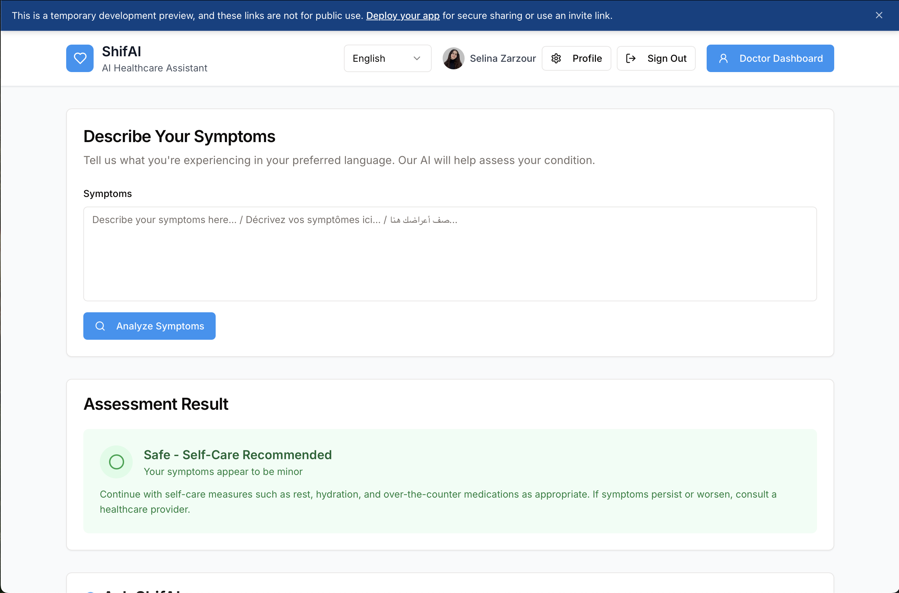
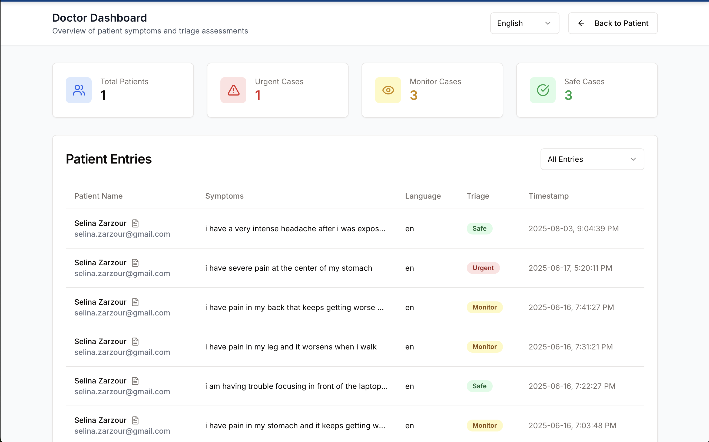
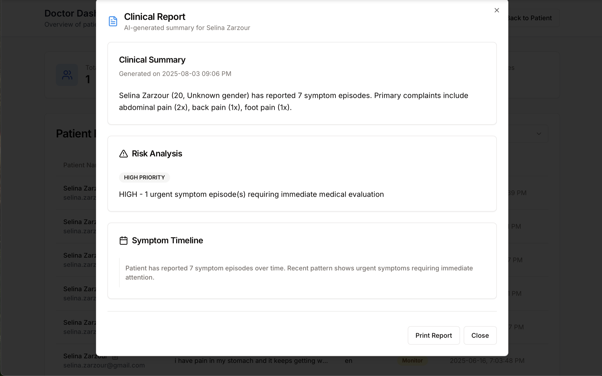
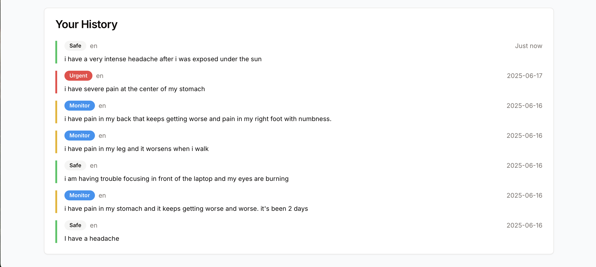

# ShifAI: AI-Powered Healthcare Assistant


## Overview

ShifAI is a multilingual AI-powered healthcare assistant designed to make healthcare more accessible, especially in regions with limited resources or language barriers. The platform empowers patients with instant symptom checks, real-time alerts for dangerous symptoms, and patient-owned medical records—all available in Arabic, English, and French.

## Features

- **AI Symptom Checker & Triage**: Get instant, AI-driven health guidance in Arabic, English, or French.
- **Real-Time Alerts**: Immediate warnings for dangerous symptoms.
- **Patient-Owned Medical Records**: Secure, user-controlled health data.
- **Interim AI Advice**: Support while waiting to see a doctor.
- **Doctor Dashboard**: Clinician view for monitoring patient input and triage levels.
- **Multilingual Support**: Full interface and AI responses in Arabic, English, and French.

## Screenshots

| Patient Main Page | Doctor Dashboard|
|-----------|----------------
|  |  |  

| Clinical Report Generator | Symptoms History 
|-----------|-----------|
|  | 

## Tech Stack

- **Frontend**: React 18, Vite, TypeScript, Tailwind CSS, TanStack Query
- **Backend**: Node.js (Express), REST API, Hugging Face Inference API
- **Database**: In-memory (for demo), Drizzle ORM (legacy), Firebase Auth/Firestore (for user data)
- **Deployment**: Netlify (frontend), Replit (backend)
- **Languages**: Arabic, English, French

## How It Works

1. **Symptom Entry**: Users enter symptoms in their preferred language.
2. **AI Triage**: The system analyzes symptoms and provides guidance, including urgency level.
3. **Alerts**: Dangerous symptoms trigger real-time alerts.
4. **Medical Records**: Users can view and manage their own health history.
5. **Doctor Dashboard**: Clinicians can monitor patient input and triage status.

## Getting Started

### Prerequisites

- Node.js 20+
- npm

### Setup

1. **Clone the repo:**
   ```sh
   git clone https://github.com/yourusername/shifai-health-assistant.git
   cd shifai-health-assistant
   ```

2. **Install dependencies:**
   ```sh
   cd client
   npm install
   cd ../server
   npm install
   ```

3. **Set up environment variables:**
   - Copy `.env.example` to `.env.production` in `client/` and fill in your Firebase and API keys.

4. **Build the frontend:**
   ```sh
   cd client
   npm run build
   ```

5. **Run the backend:**
   ```sh
   cd ../server
   npm start
   ```

6. **Deploy:**
   - Frontend: Upload `dist/public` to Netlify.
   - Backend: Deploy `server/` to Replit or your preferred Node.js host.

## Project Structure

```
client/         # React frontend
server/         # Express backend
shared/         # Shared types and schemas
screenshots/    # App screenshots for README
```

## Languages

- 🇦🇪 Arabic
- 🇫🇷 French
- 🇬🇧 English

## Inspiration

The idea for this project was inspired by real conversations with friends and family about healthcare access and the need for reliable, multilingual digital health tools.

## Contributing

Open to feedback, ideas, and collaboration! If you’re interested in improving ShifAI or want to discuss digital health, feel free to reach out or open an issue.

## License

MIT
